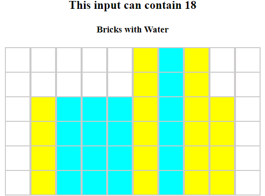
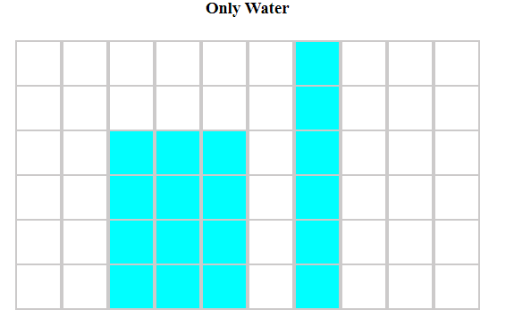

1.This is the home page of this website.

2.Here you can see two buttons.

:star: Generate Input
- This button helps you add some value to the input field
  
:star: Submit.
- If you press this button with empty input filed,Alert will be shown.
- Once you entered the value in the filed,then press the submit button.
- Then you can see the results,It will show two tables.

Here is an example

